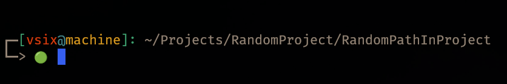

# vsix8625

## About Me
I started coding in Dec 2023 and quickly discovered my passion for it.
Although I'm not currently working as a developer, I enjoy building projects in my spare time.
My focus areas include C programming, development tools, systems programming, and learning about game engine development.

## 🌐 Focus Language
- **Focus Language:** C

## 🔧 Technologies & Tools
- **Editor:** Neovim
- **Terminal:** Kitty, Gnome
- **OS:** Linux Mint
- **Version Control:** Git
- **Compiler:** GCC, clang
- **Build Tools:** Make, CMake, Ninja, Custom scripts.

My Prompt

## 
